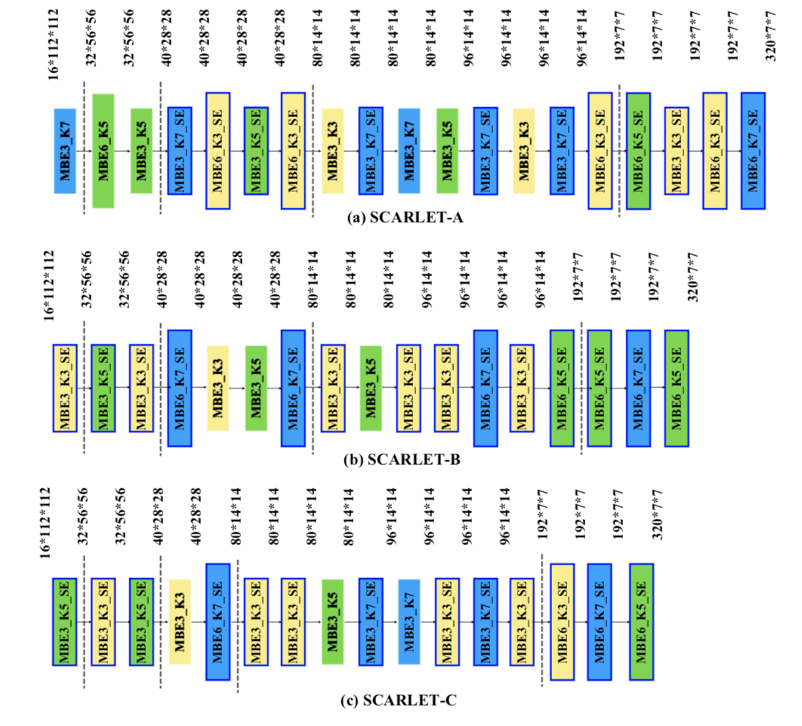
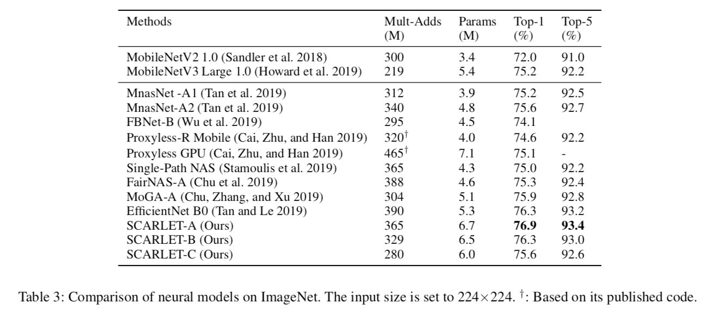

# SCARLET-NAS: Bridging the gap Between Stability and Scalability in Neural Architecture Search 

To discover compact models of great power is the goal of neural architecture search. Previous one-shot approaches are limited by fixed-depth search spaces. Simply paralleling skip connections with other choices can make depths variable. Unfortunately, it creates a large range of perturbation for supernet training, which makes it difficult to evaluate models. In this paper, we unveil its root cause under single-path settings and tackle the problem by imposing an equivariant learnable stabilizer on each skip connection. It has threefold benefits: improved convergence, more reliable evaluation, and retained equivalence. The third benefit is of the uttermost importance for scalability. As appending stabilizers to a model doesn't change its representational capacity, we can now evaluate the stabilized counterpart as an identical proxy. With an evolutionary search backend that treats the supernet as an evaluator, we derive a family of state-of-the-art architectures, the SCARLET (SCAlable supeRnet with Learnable Equivariant sTablizer)series, at a tremendously reduced cost compared with EfficientNet.

## SCARLET Architectures


## Requirements
* Python 3.6 +
* Pytorch 1.0.1 +
* The pretrained models are accessible after submitting a questionnaire: https://forms.gle/Df5ASj4NPBrMVjPy6
* 国内用户请填写问卷获取预训练模型： https://wj.qq.com/s2/4301641/0b80/

## Updates

* 20-Aug-2019： Model release of SCARLET-A, SCARLET-B, SCARLET-C.

## Performance Result


## Preprocessing
We have reorganized all validation images of the ILSVRC2012 ImageNet by their classes.

1. Download ILSVRC2012 ImageNet dataset.

2. Change to ILSVRC2012 directory and run the preprocessing script with
    ```
    ./preprocess_val_dataset.sh
    ```

## Evaluate

     python3 verify.py --model [Scarlet_A|Scarlet_B|Scarlet_C] --device [cuda|cpu] --val-dataset-root [ILSVRC2012 root path] --pretrained-path [pretrained model path]

## Citation

Your kind citations are welcomed!


    @inproceedings{chu2021scarlet,
        title={SCARLET-NAS: Bridging the gap Between Scalability and Fairness in Neural Architecture Search},
        author={Chu, Xiangxiang and Zhang, Bo and Li, Qingyuan and Xu, Ruijun and Li, Xudong},
        booktitle={ICCV Workshops},
        url={https://arxiv.org/pdf/1908.06022.pdf},
        year={2021}
    }
